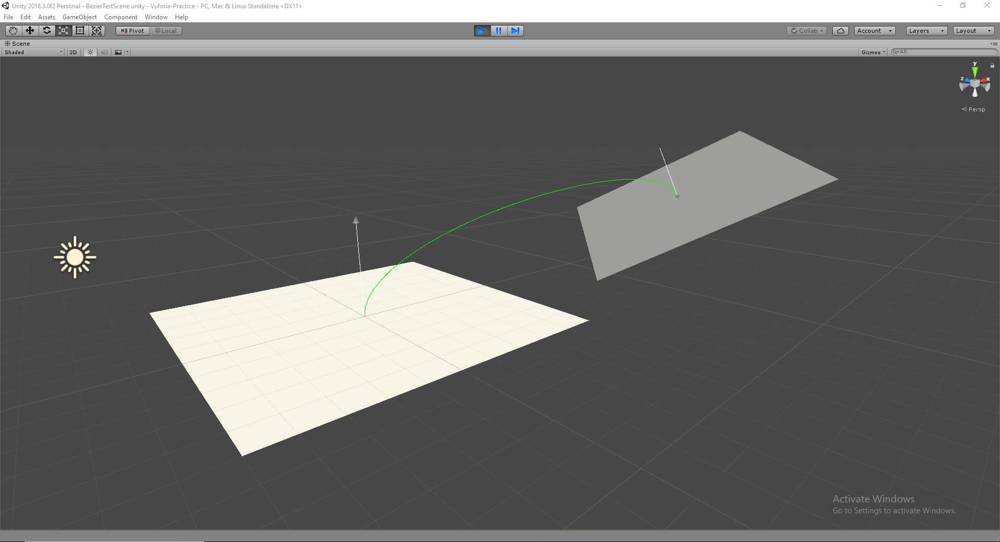
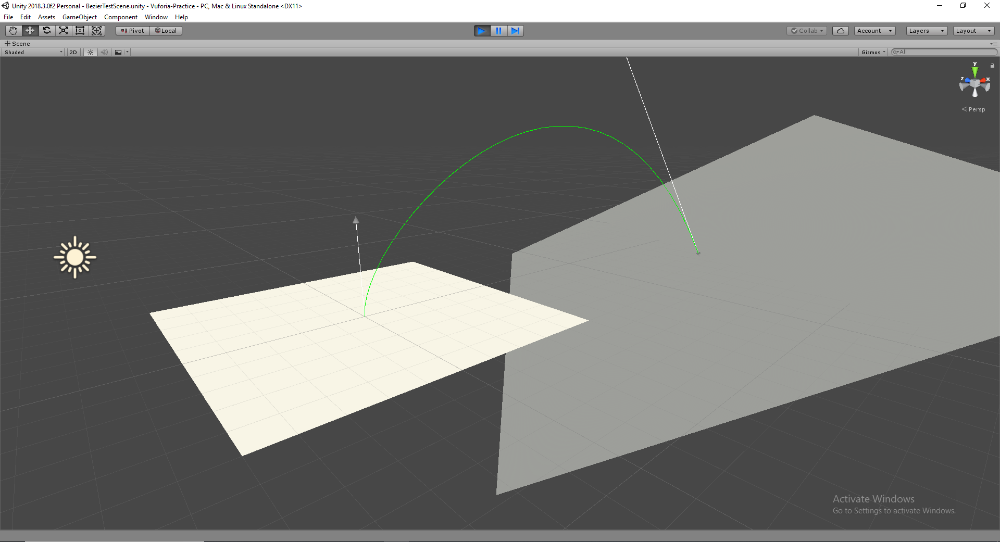

# Vuforia Practice 

This application will be for implementing a visual experience that has a an openning gate, closing gate and an object moving between them. 

## TODO list

- [x] Bezier Curves

List of Vector3 points between right and left tangents gets updated on call.
With resolution as the number of points.

    
    

- [x] Bezier Curves Object Controlled

Bezier curve is now controlled by an object. emiiting the curve from its up direction controlled by its position,rotation and scale for curve tangent length.

    
    

