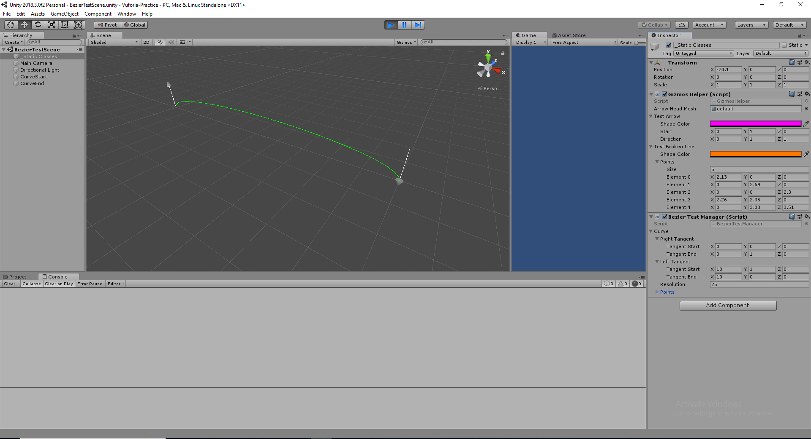
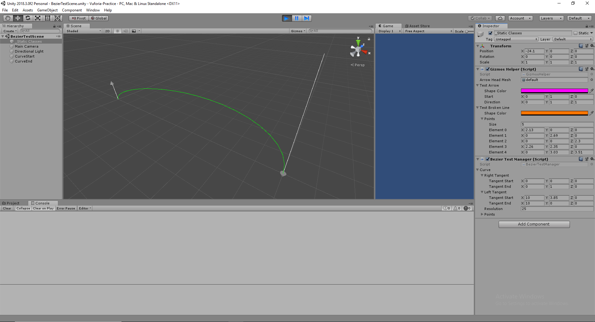

# Vuforia Practice 

This application will be for implementing a visual experience that has a an openning gate, closing gate and an object moving between them. 

## TODO list

- [x] Bezier Curves

List of Vector3 points between right and left tangents gets updated on call.
With resolution as the number of points.

